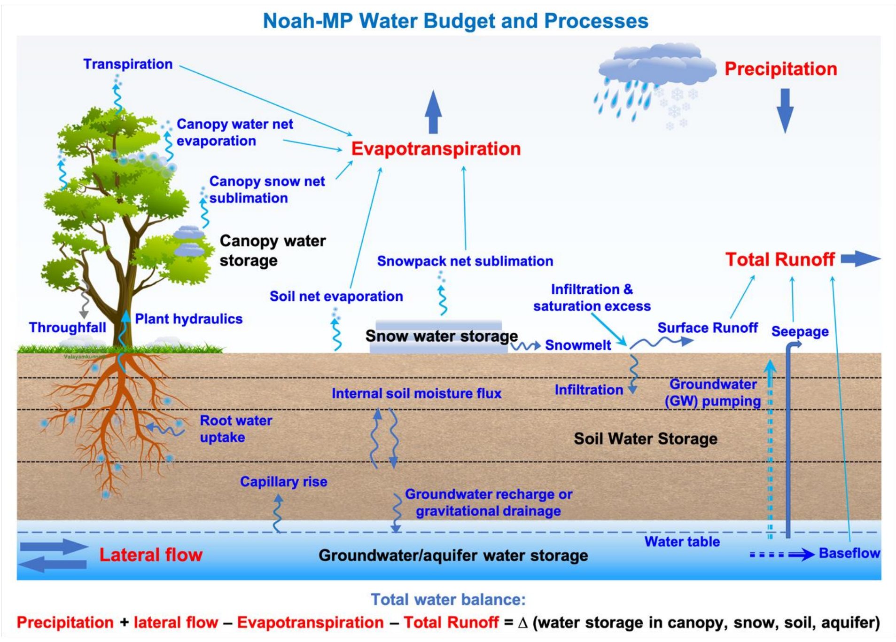

## News

- <strong>January 2026 – AMS Annual Meeting:</strong> Our group is presenting the latest research on land surface processes and hydroclimate extremes at the AMS Meeting in Houston.
- <strong>December 2025 – Major Honor:</strong> Dr. Zong-Liang Yang has been elected a 2025 AGU Fellow, recognized for his pioneering leadership and outstanding contributions to the understanding of land surface interactions.
- <strong>December 2025 – Congratulations to our Graduates!</strong> We celebrate the successful defenses and graduations of Jagger, Sui, and Mbarak. We wish them success in their future careers.
- <strong>September 2025 – Milestone:</strong> Congratulations to Shuku for successfully passing the qualifying exam and advancing to PhD candidacy!
- <strong>January 2025 – Major Honor:</strong> Dr. Zong-Liang Yang has been named an AMS Fellow, recognizing excellence in the atmospheric and related sciences.

    <iframe width="820" height="461" src="https://www.youtube-nocookie.com/embed/e5cz3WhE_NI?si=vAySsQE4cTpka1Cs&amp;controls=0" title="YouTube video player" frameborder="0" allow="accelerometer; autoplay; clipboard-write; encrypted-media; gyroscope; picture-in-picture; web-share" referrerpolicy="strict-origin-when-cross-origin" allowfullscreen></iframe>

<!--

    <iframe width="800" height="450" src="https://www.youtube-nocookie.com/embed/e5cz3WhE_NI?si=vAySsQE4cTpka1Cs&amp;controls=0" title="YouTube video player" frameborder="0" allow="accelerometer; autoplay; clipboard-write; encrypted-media; gyroscope; picture-in-picture; web-share" referrerpolicy="strict-origin-when-cross-origin" allowfullscreen></iframe>

-->

<strong>Welcome to the Land Environment and Atmospheric Dynamics (LEAD) Group established by Dr. Zong-Liang Yang at UT-Austin.</strong>

The LEAD group consists of graduate research assistants, postdoctoral fellows and visiting scholars. We view the earth system in a holistic way, linking the atmosphere, ocean, biosphere, cryosphere, and solid earth as an integrated system. We use powerful methodologies such as satellite remote sensing, earth system modeling, and high performance computing which are now profoundly changing research in earth system sciences. We place a strong emphasis on the societal impact of the research in earth system sciences. Specifically, we are working to answer a wide variety of earth science questions below.

- How does land shape climate, or vice versa, on all time and space scales?
- What has been the impact of human activity on the Earth?
- What is the future of our environment in the face of changing climate, land use, and human demands?
- What is our prospect for regional and global river reanalysis? How can we predict river flows at continental and global scales?
- How accurate are climate models in simulating biosphere-hydrosphere-atmosphere interactions? What are their uncertainties? How can we improve them? How can we make decisions under uncertainties?
- Are current satellite datasets alone sufficient for monitoring our environmental conditions? How can we integrate satellite data in the decision-making process?

We strive to advance understanding and provide insights into these critical questions, contributing to the broader field of Earth system sciences.

<!--<h2><a href="https://lead-utexas.github.io/about/contact">Contact/Inquiries</a></h2>-->
